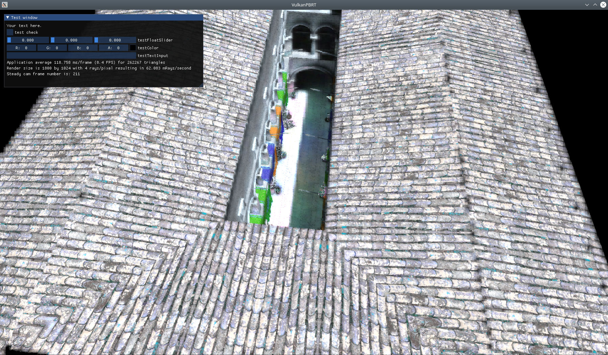
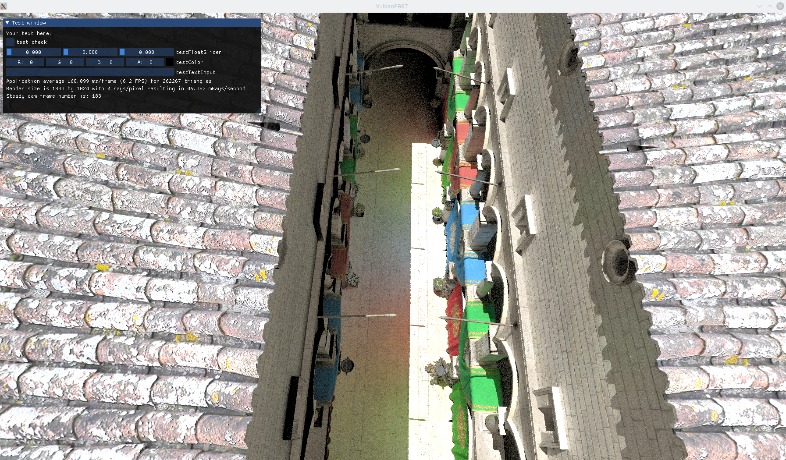
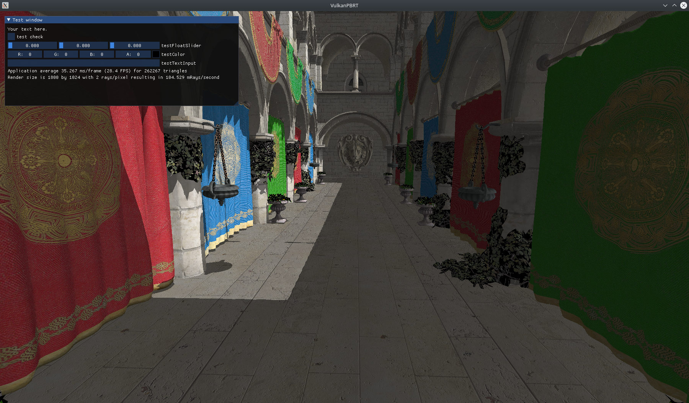
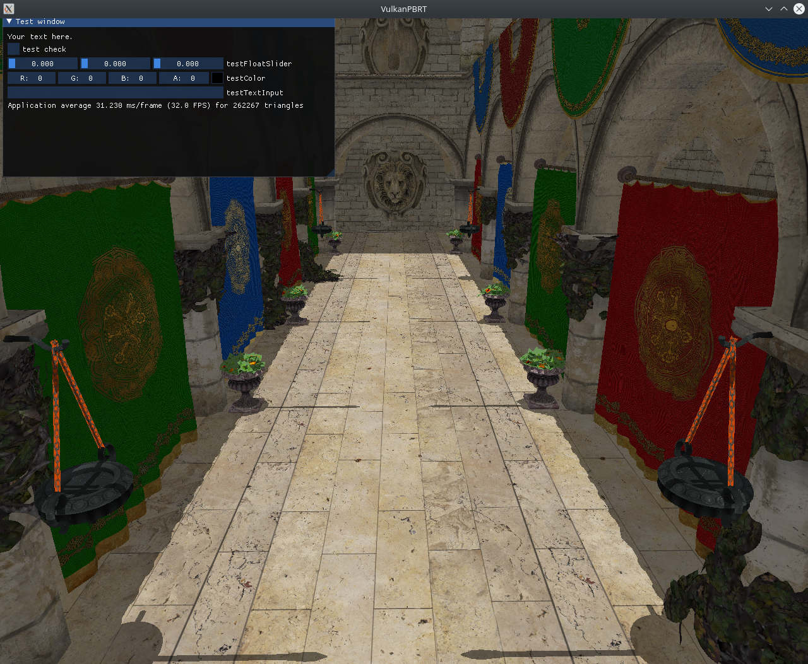
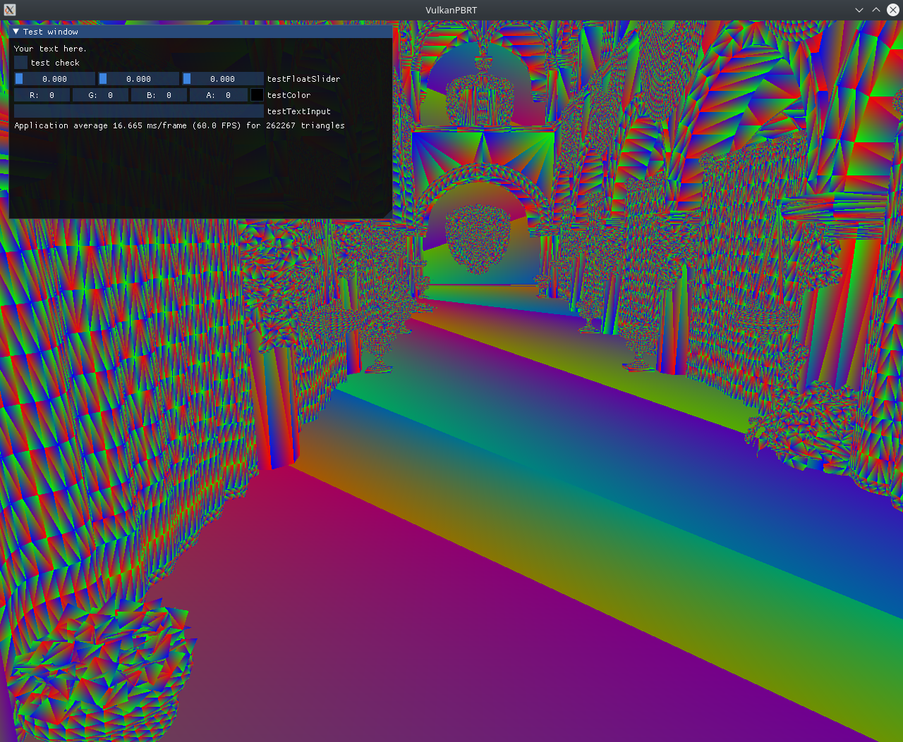

# VulkanPBRT
Vulkan physically based raytracer including denoising.

The GPU raytracer is based on Vulkan only, as well as for the denoising only the Vulkan Compute capabilities will be used.

For faster and easier development the [VulkanSceneGraph](https://github.com/vsg-dev/VulkanSceneGraph) library is used. It provides an easier interface to Vulkan, has resource management included and allows pipeline setup via a scene graph. Further GLSL like math classes are included.

The raytracer itself is intended to be easily customizable to be used for different tasks. The implementations done here should provide a good working baseline. To make this possible, all rendering related classes here are only doing setup code with the vsg library. All resources used for rendering are put into public attributes, which can then be forwarded to the scene graph structure. To record the pipeline and other needed resources see the example use in VulkanPBRT.cpp.

# Current Project Status
The todos, in progress and done tasks can be found in the [Projects tab](https://github.com/Lachei/VulkanPBRT/projects/1).

A list of supported features and screenshots (Top is most recent feature):
- [x] First denoising with gradient descent l2 feature regression implemented



- [x] Importance sampling and ray recursion done(Small generalisation for normals still has to be done).






- [x] Physically based lighting computation implemented.



- [x] Shadow test via shadow rays works
- [x] Textures now supported for arbitrary scenes (All textures for physically based rendering already included)
    - TODO: better material detection for automatic texture loading, more testing on other scenes, cleanup of code

- [x] Changed NV_Raytracing completeley to KHR_Raytracing



- [x] Basic camera navigation via trackball
- [x] Inclusion of obj, stl, ... opener, supported 3d types are:
    
    3d        , 3ds     , 3mf     , ac      , ac3d    , acc     , amf     , ase     , ask     , assbin  , b3d     , blend   , bvh     , cob     , csm     , dae     , dxf     , enff    , fbx     , glb     , gltf    , hmp     , ifc     , ifczip  , irr     , irrmesh , lwo     , lws     , lxo     , m3d     , md2     , md3     , md5anim , md5camera, md5mesh , mdc     , mdl     , mesh    , mesh.xml, mot     , ms3d    , ndo     , nff     , obj     , off     , ogex    , pk3     , ply     , pmx     , prj     , q3o     , q3s     , raw     , scn     , sib     , smd     , stl     , stp     , ter     , uc      , vta     , x       , x3d     , x3db    , xgl     , xml     , zae     , zgl     
- [x] Inclusion of ImGui
- [x] Project setup based on VulkanSceneGraph

# Compilation Notes
This project depends on the Vulkan library to be installed, so head over to the [Vulkan Website](https://vulkan.lunarg.com/sdk/home) and download the appropriate SDK.

The basis for implementation is the [VulkanScenGraph (VSG)](https://github.com/vsg-dev/VulkanSceneGraph) library. All needed files of VSG are included in this repository and do not have to be installed.

Further the threads, xcb and assimp libraries are needed and have to be found by cmake via a find_package call.

The shaders for the projects are automatically compiled by cmake when the project is built. If you should change the source code of the shaders this compilation will automatically be re-run on the next build instruction.

To build the project, simply
```
cd VulkanPBRT
mkdir build
cd build
cmake ..
make -j 8
```
(the `-j 8` instruction for the `make` command enables multi threaded compilation)

# Vsg Notes
The local copy of the vsg library is being held up to date via `git subtree`.

In order to update `vsg`, `vsgXchange` and `vsgImGui` open a terminal in the `VulkanPBRT` folder and type the following commands:
```
git subtree pull --prefix external/vsg git@github.com:vsg-dev/VulkanSceneGraph.git master --squash 
git subtree pull --prefix external/vsgXchange git@github.com:vsg-dev/vsgXchange.git master --squash 
git subtree pull --prefix external/vsgImGui git@github.com:vsg-dev/vsgImGui.git master --squash 
```

For more information about how to use more complex `git subtree` commands see the [subtree manual](https://manpages.debian.org/testing/git-man/git-subtree.1.en.html).
