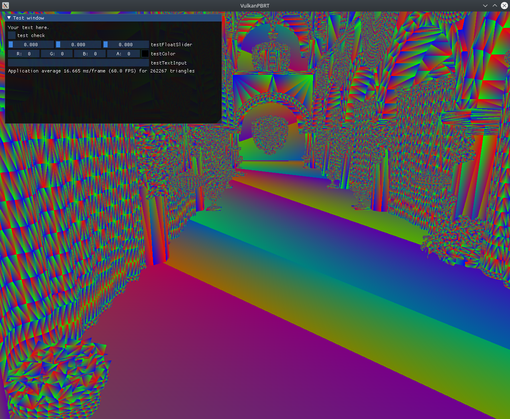

# VulkanPBRT
Vulkan physically based raytracer including denoising.

The GPU raytracer is based on Vulkan only, as well as for the denoising only the Vulkan Compute capabilities will be used.

For faster and easier development the [VulkanSceneGraph](https://github.com/vsg-dev/VulkanSceneGraph) library is used. It provides an easier interface to Vulkan, has resource management included and allows pipeline setup via a scene graph. Further GLSL like math classes are included.

# Current Project Status
The todos, in progress and done tasks can be found in the [Projects tab](https://github.com/Lachei/VulkanPBRT/projects/1).

A list of supported features and screenshots (Top is most recent feature):

- [x] Changed NV_Raytracing completeley to KHR_Raytracing



- [x] Basic camera navigation via trackball
- [x] Inclusion of obj, stl, ... opener, supported 3d types are:
    - 3d        
    - 3ds     
    - 3mf     
    - ac      
    - ac3d    
    - acc     
    - amf     
    - ase     
    - ask     
    - assbin  
    - b3d     
    - blend   
    - bvh     
    - cob     
    - csm     
    - dae     
    - dxf     
    - enff    
    - fbx     
    - glb     
    - gltf    
    - hmp     
    - ifc     
    - ifczip  
    - irr     
    - irrmesh 
    - lwo     
    - lws     
    - lxo     
    - m3d     
    - md2     
    - md3     
    - md5anim 
    - md5camera
    - md5mesh 
    - mdc     
    - mdl     
    - mesh    
    - mesh.xml
    - mot     
    - ms3d    
    - ndo     
    - nff     
    - obj     
    - off     
    - ogex    
    - pk3     
    - ply     
    - pmx     
    - prj     
    - q3o     
    - q3s     
    - raw     
    - scn     
    - sib     
    - smd     
    - stl     
    - stp     
    - ter     
    - uc      
    - vta     
    - x       
    - x3d     
    - x3db    
    - xgl     
    - xml     
    - zae     
    - zgl     
- [x] Inclusion of ImGui
- [x] Project setup based on VulkanSceneGraph

# Compilation Notes
This project depends on the Vulkan library to be installed, so head over to the [Vulkan Website](https://vulkan.lunarg.com/sdk/home) and download the appropriate SDK.

The basis for implementation is the [VulkanScenGraph (VSG)](https://github.com/vsg-dev/VulkanSceneGraph) library. All needed files of VSG are included in this repository and do not have to be installed.

Further the threads, xcb and assimp libraries are needed and have to be found by cmake via a find_package call.

The shaders for the projects are automatically compiled by cmake when the project is built. If you should change the source code of the shaders this compilation will automatically be re-run on the next build instruction.

To build the project, simply
```
cd VulkanPBRT
mkdir build
cd build
cmake ..
make -j 8
```
(the `-j 8` instruction for the `make` command enables multi threaded compilation)